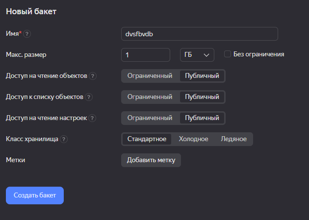
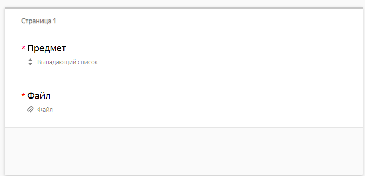
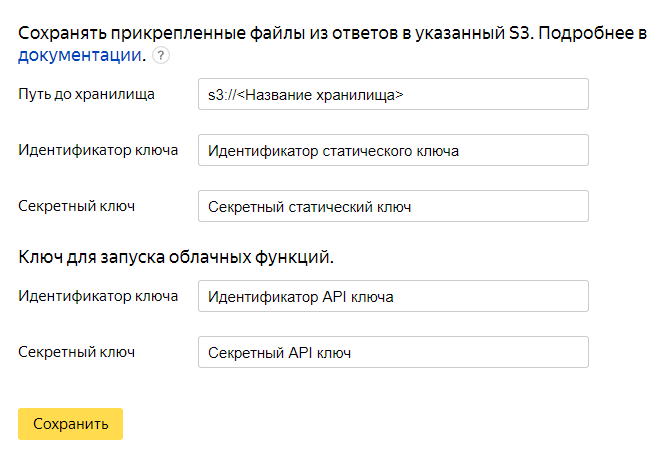
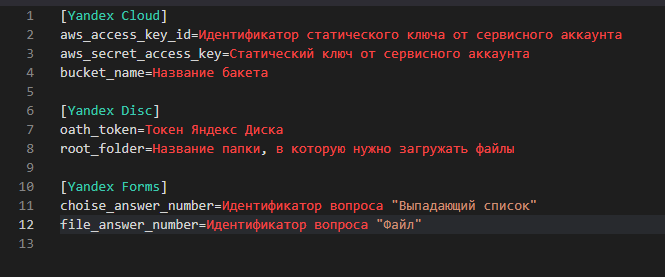

# yc-to-yd-sorter
Скрипт, который позволяет разграничить доступ на загрузку файлов на Yandex Disk. Также, этот скрипт помогает в сортировке файлов в разные папки на диске.

# Установка

## 1. Работа с [Yandex Cloud](https://console.cloud.yandex.ru)
### Создание Cloud Function

1. Скачиваете код с GitHub;
2. Делаете из файлов `index.py, requirements.txt, work_with_boto3.py, settings.ini` архив;
3. Создаете функцию и загружаете её по [инструкции](https://cloud.yandex.ru/docs/functions/quickstart/create-function/python-function-quickstart)
4. Настройки функции выставляете такие
    - Точка входа — `index.handler`;
    - Таймаут, c — `Количество файлов, которые будут загружаться + 1 с`;
    - Память — `256 МБ`.
5. Нажимаете кнопку `Сохранить изменения`
> [!IMPORTANT]
> Во вкладке `Обзор` запоминаете поле `Идентификатор`(понадобится для следующих действий).

### [Создание сервисного аккаунта](https://cloud.yandex.ru/docs/iam/operations/sa/create)

По инструкции нужно создать сервисный аккаунт. 

При создании сервисного аккаунта нужно выдать ему следующие роли: 

- storage.admin
- storage.configViewer
- serverless.functions.invoker
- storage.editor
- storage.viewer
- storage.configurer
- storage.uploader

### [Создание статического ключа для работы с сервисным аккаунтом](https://cloud.yandex.ru/docs/iam/operations/sa/create-access-key)

В данной части вы создаете ключ для работы с сервисным аккаунтом.

Также создайте API-ключ для доступа к вашим функциям
> [!IMPORTANT]
> Запомните поля `Идентификатор ключа:` и `Ваш секретный ключ:` для статического и API ключей. Они пригодятся вам в дальнейшем.
  
### Создание Бакета

  - В [консоли управления]((https://console.cloud.yandex.ru)) выберите каталог, в котором хотите создать бакет.
  - Выберите сервис Object Storage.
  - Нажмите кнопку Создать бакет.
  - Выбираете настройки, как на скриншоте, и нажимаете "Создать бакет"
  
> [!IMPORTANT]
> Запомните `название` своего бакета. Оно пригодится вам в дальнейшем.

## 2. Работа с [Yandex Forms](https://forms.yandex.ru/cloud/admin)

### Создание формы.

Для того, чтобы пользоваться скриптом, нужно создать Яндекс Форму. 

> [!WARNING]
> Обязательно нужно создать форму для бизнеса, так как только в ней можно работать с S3 хранилищем

Настройка формы зависит от вашей фантазии и тех потребностей, которые вам нужны будут. Но для работы скрипта обязательно нужно создать 2 вопроса:

> [!IMPORTANT]
> P.S. При создании вопросов запомните поле `Идентификатор вопроса` для вопроса типов: `Файл` и `Выпадающий список`. Они будут использованы позднее 

> [!WARNING]
> P.P.S. Настоятельно рекомендуем ставить вопросы **обязательного порядка** во избежание ошибок с работой скрипта
 
### Настройка формы

После выстраивания своей формы нужно перейти во вкладку `Настройки` -> `Дополнительно`

Внизу заполняем следующие данные:

**Нажимаем кнопку `Сохранить`**

### Настройка интеграции Яндекс Форм

1. Переходим на вкладку `Интеграция`
2. Добавляем вызов Cloud Functions
    - В окно "Код функции" вписываем `Идентификатор`, который мы запомнили на этапе `Создание Cloud Function`
3. Отключаем параметр `Показывать сообщение о результате действия`
4. Сохраняем настройки

## Работа с Яндекс Диском
1. Создаете папку на Яндекс Диске, в которую будете загружать файлы. Обязательно запоминаете путь. Пример путя:
    - `/Папка в корневом каталоге/Вложенная папка/Вложенная папка 2`
2. Получаете токен для доступа к Яндекс Диску. Подробнее вы можете почитать [Здесь](https://yandex.ru/dev/disk/api/concepts/quickstart.html#quickstart__oauth)
> [!IMPORTANT]
> Запомните токен, который у вас получится. Он вам пригодится в будущем

### Финальные штрихи с Yandex Cloud Function
1. Заходим в раздел Cloud Functions через [консоль управления](https://console.cloud.yandex.ru)
2. Заходим в нашу функцию -> Редактор -> открываем файл `settings.ini`
3. Заполняем файл в соответствии со скриншотом ниже

4. Сохраняем функцию кнопкой `Сохранить`
